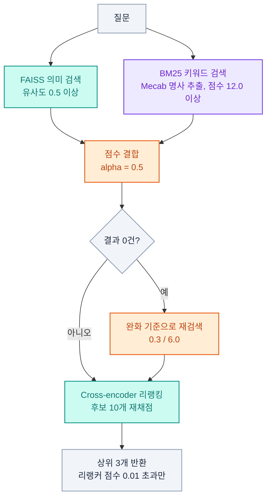
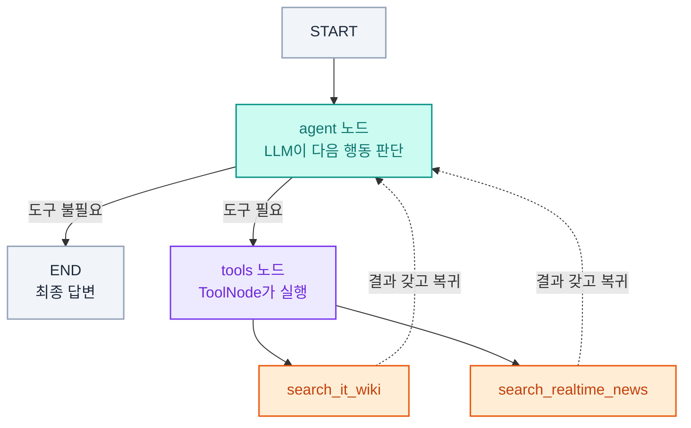

# rain-research-bot

> IT 개념 질문과 최신 시사·기업 뉴스를 구분해서, 알맞은 도구로 조사해 답하는 LangGraph 기반 리서치 에이전트

`Python` `LangChain` `LangGraph` `FastAPI` `Docker` `AWS EC2` `GitHub Actions`

---

## 소개

"OAuth가 뭐야?" 같은 개념 질문과 "오늘 삼성전자 뉴스 있어?" 같은 시사 질문은 정보의 성격이 다르다. 전자는 시간이 지나도 안 바뀌는 지식이고, 후자는 매번 바뀌는 정보다. 이 프로젝트는 이 둘을 하나의 파이프라인으로 뭉뚱그리지 않고, Agent가 질문 성격을 스스로 판단해서 알맞은 도구를 고르도록 설계했다.

- IT 개념·배경지식 질문 → 미리 구축해둔 위키 기반 인덱스에서 검색 (정적, 빠름)
- 실시간 시사·기업 정보 → 네이버 뉴스 API로 그때그때 검색 (동적, 최신)

에이전트는 하나이고, 그 안에 도구 두 개를 붙인 구조다(단일 에이전트 + 다중 도구).

---

## 사용자 페르소나

기능을 늘리기 전에 "누구의 어떤 불편을 해결하는가"를 먼저 정의했다. 이후의 기술 결정은 대부분 여기서 출발한다.

**주 사용자 (Primary)** — 부트캠프 수강생·취준생
실제 사용 로그가 존재하는 유일한 대상이라 주 사용자로 삼았다.

**아직 확인하지 못한 사용자 (Secondary)** — 1~3년차 주니어 개발자

실무를 하면서 최신 도구 흐름을 따라가야 하는 사람들도 이 도구를 쓸 것 같다. 다만 이건 아직 짐작이다. 실제로 그런 개발자에게 물어보거나 사용 기록을 확인한 적이 없어서, 확정된 사용자로 적지 않고 앞으로 확인해볼 대상으로만 남겨둔다.

**사용 상황 3가지**

| 상황 | 필요한 것 | 대응 |
|---|---|---|
| 강의·과제 중 모르는 용어를 급히 확인 | 짧은 대기 시간 | 스트리밍 응답 (예정) |
| 면접 준비, 기업 최신 동향 파악 | 원문으로 이동 | 뉴스 답변에 기사 링크 제공, 새 탭 열기 |
| 출퇴근길·자기 전 트렌드 훑어보기 | 읽기 편한 형태 | 마크다운 렌더링(목록·강조·링크) |

**일부러 대상에서 뺀 상황**

"이번 프로젝트에 어떤 기술을 쓸지 정하는" 상황은 이 도구가 맡지 않는다.

무엇을 도입할지 결정하려면 공식 문서를 정독하거나 실제로 써보면서 비교해야 하는데, 위키 요약과 뉴스 몇 줄로는 그 판단을 뒷받침할 수 없다. 이 도구는 "그게 뭔지 빠르게 감을 잡는" 단계까지만 담당한다.

**직접 겪은 불편(pain point)**

1. "RAG가 뭐야?"에 답하지 못함 → 시드 확장 + 뉴스 폴백으로 해결
2. 답변이 다 만들어질 때까지 로딩 점만 보임 → 스트리밍으로 처리 예정

---

## 주요 기능

- **IT 개념 검색**: 한국어 위키백과 기반 하이브리드 검색(FAISS 의미 검색 + BM25 키워드 검색) + Cross-encoder 리랭킹
- **실시간 뉴스 검색**: 네이버 뉴스 검색 API로 최신순 뉴스 조회, 기사 원문 링크 함께 제공
- **검색 실패 시 폴백**: IT·기술 질문인데 위키 인덱스에 문서가 없으면 자동으로 뉴스 검색으로 넘어가고, 그 사실을 답변에 명시
- **Agent 라우팅**: 두 도구 중 무엇을 쓸지 사람이 규칙을 짜지 않고, LLM이 tool-calling으로 스스로 판단
- **대화 기억**: 같은 세션(thread) 안에서는 이전 질문을 기억하고 이어서 답변. 새로고침해도 유지
- **웹 채팅 UI**: 마크다운 렌더링, 클릭 가능한 기사 링크, 사용된 도구 표시
- **배포 자동화**: Docker 이미지 빌드 → Docker Hub push → EC2 재기동까지 GitHub Actions로 자동화

---

## RAG 아키텍처

### 데이터 파이프라인 (사전 준비, 1회 실행)

```mermaid
flowchart LR
    S["IT 시드 용어<br/>59개"] --> W["한국어 위키백과<br/>문서 수집"]
    W --> L["링크 확장 수집<br/>문서당 최대 15개"]
    L --> F["필터링<br/>목록·동음이의·짧은 문서 제외"]
    F --> D["문서 431개"]
    D --> C["부록 섹션 제거<br/>문서당 평균 232자"]
    C --> K["청킹<br/>500자 / 겹침 50자"]
    K --> E["BAAI/bge-m3 임베딩"]
    E --> I["FAISS 인덱스<br/>청크 7,835개"]

    classDef gray fill:#f1f5f9,stroke:#94a3b8,stroke-width:1.5px,color:#1e293b;
    classDef teal fill:#ccfbf1,stroke:#0d9488,stroke-width:1.5px,color:#0f766e;
    classDef purple fill:#ede9fe,stroke:#7c3aed,stroke-width:1.5px,color:#6d28d9;
    classDef orange fill:#ffedd5,stroke:#ea580c,stroke-width:1.5px,color:#c2410c;

    class S,D,I gray
    class W,L teal
    class F,C purple
    class K,E orange
```



청킹할 때 각 청크 앞에 문서 제목을 붙인다. 청크만 떼어놓으면 무엇에 대한 설명인지 알 수 없는 경우가 많기 때문이다.

### 검색 단계 (질문마다 실행)



리랭킹은 `use_reranker` 플래그로 켜고 끌 수 있다. 다른 조건을 그대로 둔 채 리랭킹 효과만 따로 측정하기 위한 구조다.

---

## LangGraph 아키텍처



`agent`와 `tools` 두 노드가, 더 이상 도구가 필요 없다고 판단할 때까지 서로를 오간다(ReAct 패턴). 이 판단은 `tools_condition`이 맡고, 실제 함수 실행은 `ToolNode`가 맡는다. 여기에 `MemorySaver`를 붙여, `thread_id`가 같은 요청끼리는 이전 대화 내용을 이어서 참조할 수 있게 했다.

이 구조 덕분에 폴백이 별도 코드 없이 성립한다. 위키 검색이 "관련 문서를 찾지 못했습니다"를 반환하면, agent 노드가 그 결과를 보고 뉴스 도구를 한 번 더 호출한다. 분기 로직을 사람이 짜는 대신 시스템 프롬프트의 규칙 한 줄로 처리했다.

---

## 요청 처리 흐름

**IT 개념 질문** — "인공지능이 뭐야?"

1. agent 노드가 배경지식 질문으로 판단하고 `search_it_wiki` 호출을 요청
2. tools 노드가 하이브리드 검색 + 리랭킹을 실행해 상위 3개 청크 반환
3. agent 노드가 검색 결과에 근거해 답변을 작성하고 종료
4. 답변과 사용된 도구(`tool_used`)를 함께 반환

**실시간 시사 질문** — "오늘 삼성전자 관련 뉴스 알려줘"

1. agent 노드가 최신 정보가 필요한 질문으로 판단하고 `search_realtime_news` 호출을 요청
2. tools 노드가 네이버 뉴스 API로 최신순 5건을 받아옴 (제목·요약·링크)
3. agent 노드가 각 기사를 한두 문장으로 요약하고 기사 링크를 붙여 목록으로 정리

**위키에 없는 최신 용어** — "RAG가 뭐야?"

1. `search_it_wiki` 호출 → 한국어 위키에 해당 문서가 없어 결과 없음
2. agent 노드가 IT 관련 질문임을 판단하고 `search_realtime_news`를 한 번 더 호출
3. "위키 문서에는 없어 최신 뉴스에서 찾은 내용입니다"를 밝히고 뉴스 기반으로 답변

**이어지는 질문** — "방금 내가 뭐라고 물어봤어?"

같은 `thread_id`의 이전 메시지를 `MemorySaver`가 불러오고, agent 노드가 그 내용을 참조해 답한다. 프론트엔드는 `thread_id`를 `localStorage`에 저장하므로 새로고침해도 대화가 이어진다.

---

## 기술 스택

| 영역 | 선택 | 이유 |
|---|---|---|
| 오케스트레이션 | LangGraph (`StateGraph(MessagesState)`) | 조건 분기·재시도를 표현하려면 일직선 파이프로는 부족 |
| 도구 판단 | tool-calling (`bind_tools` + `ToolNode` + `tools_condition`) | 키워드 매칭이 아니라 LLM이 도구 설명(docstring)을 보고 직접 판단 |
| 대화 기억 | `MemorySaver` + `thread_id` | 세션별로 대화 맥락 유지 |
| IT 지식 소스 | 한국어 위키백과 (시드 59개 + 링크 확장) | IT 개념 설명에 특화된 문서를 직접 확보 |
| 검색 | 하이브리드 (FAISS + Mecab/BM25) | 의미 검색과 키워드 검색을 절반씩 결합 |
| 재정렬 | Cross-encoder (`BAAI/bge-reranker-v2-m3`) | 1차 후보 10개를 질문-문서 쌍으로 재채점해 상위 3개만 통과 |
| 실시간 정보 | 네이버 뉴스 검색 API | 한국 기업 뉴스 품질이 좋고 무료 할당량이 넉넉함 |
| 생성 LLM | Gemini 2.5 Flash | 라우팅 판단, 답변 생성, 평가 채점 모두 동일 모델 |
| 배포 | FastAPI + Uvicorn, Docker, AWS EC2 | REST API + 정적 채팅 UI를 한 컨테이너로 배포 |
| CI/CD | GitHub Actions | main 브랜치 push 시 빌드·배포 자동 실행 |

---

## 프로젝트 구조

```
rain-research-bot/
├── .github/workflows/
│   └── deploy.yml              # push -> Docker Hub -> EC2 자동 배포
├── src/
│   ├── llm.py                  # LLM 빌더
│   ├── retriever.py            # 하이브리드 검색 + 리랭킹 (플래그로 on/off)
│   ├── naver_news_tool.py      # 네이버 뉴스 API 호출
│   ├── tools.py                # 위 두 기능을 LangChain Tool로 등록
│   ├── agent.py                # StateGraph 기반 Agent + 시스템 프롬프트
│   └── api.py                  # FastAPI 배포 + 정적 파일 서빙
├── scripts/
│   ├── collect_wiki.py         # 위키 IT 문서 수집 (재시도·중간 저장 포함)
│   ├── clean_wiki_docs.py      # 부록 섹션 제거
│   ├── build_index.py          # 청킹 + 임베딩 + FAISS 인덱스 구축
│   └── debug_retrieval.py      # 리랭킹 on/off 검색 결과 비교 진단
├── evaluation/
│   ├── qa_dataset.py           # 라우팅 6문항 + 품질 3문항
│   ├── metrics.py              # 지표 5종 (LLM-judge 4종 + 직접 계산 1종)
│   └── run_evaluation.py       # 평가 실행 및 결과 저장
├── static/
│   └── index.html              # 웹 채팅 UI
├── data/
│   ├── it_wiki_docs.json
│   ├── it_wiki_docs_clean.json
│   └── faiss_index_it/
├── tests/
│   └── test_search.py
├── Dockerfile
├── docker-compose.yml
├── docker-compose-ec2.yml
└── requirements.txt
```

---

## 실행 방법

### 로컬 실행

```bash
pip install -r requirements.txt
```

저장소 루트에 `.env` 파일을 만들고 아래 값을 채운다.

```
GOOGLE_API_KEY=발급받은_Gemini_API_키
NAVER_CLIENT_ID=발급받은_네이버_Client_ID
NAVER_CLIENT_SECRET=발급받은_네이버_Client_Secret
```

인덱스를 처음 만드는 경우에만 아래 3개를 순서대로 실행한다.

```bash
python3 scripts/collect_wiki.py
python3 scripts/clean_wiki_docs.py
python3 scripts/build_index.py
```

서버 실행 후 `http://localhost:8003`에서 채팅 UI, `http://localhost:8003/docs`에서 Swagger를 쓸 수 있다.

```bash
python3 src/api.py
```

### Docker 실행

```bash
docker compose up -d
```

### 평가 실행

```bash
# 리랭킹 적용 상태
python3 evaluation/run_evaluation.py

# 리랭킹 없이 (baseline 비교용)
USE_RERANKER=false python3 evaluation/run_evaluation.py
```

---

## 데모

```
POST /ask
{ "question": "인공지능이 뭐야?" }

{
  "answer": "인공지능은 방대한 데이터를 학습하여 인간의 인지 기능을 모방하고
             다양한 문제를 해결하는 기술입니다. ...",
  "tool_used": "search_it_wiki"
}
```

```
POST /ask
{ "question": "RAG가 뭐야?" }

{
  "answer": "위키 문서에는 없어 최신 뉴스에서 찾은 내용입니다.
             RAG는 '검색 증강 생성(Retrieval-Augmented Generation)'의 약자로 ...",
  "tool_used": "search_realtime_news"
}
```

---

## 평가

### 평가 설계

| 축 | 대상 | 방식 |
|---|---|---|
| 라우팅 정확도 | 6문항 (IT 3 + 뉴스 3) | 기대 도구와 실제 호출 도구 일치 여부 |
| 답변 품질 | IT 3문항 | 지표 5종 채점 |

`keyword_recall`은 코드로 직접 계산하고, 나머지 4종(`faithfulness`, `answer_relevancy`, `context_precision`, `context_recall`)은 RAGAS 표준 개념을 참고해 LLM-judge 방식으로 구현했다. API 호출 수를 줄이려고 4개 지표를 1회 호출로 통합 채점한다.

### 변수 분리

리랭킹 도입과 인덱스 확장(258 → 431 문서)을 같은 시기에 진행해서, 한 번의 측정으로는 어느 쪽 효과인지 구분할 수 없었다. 조건을 셋으로 나눠 측정했다.

| 조건 | 인덱스 | 리랭킹 |
|---|---|---|
| v1 | 문서 258개 | 없음 |
| v1-new | 문서 431개 | 없음 |
| v2 | 문서 431개 | 있음 |

### 결과

라우팅 정확도는 모든 조건에서 100%(6/6), `keyword_recall`과 `faithfulness`는 모든 조건에서 1.00이었다. 차이가 난 지표만 정리하면 아래와 같다.

| 지표 | v1 | v1-new (1회차) | v2 (1회차) | v1-new (2회차) | v2 (2회차) |
|---|---|---|---|---|---|
| answer_relevancy | 0.53 | 0.50 | 0.93 | 0.73 | 0.90 |
| context_precision | 0.33 | 0.33 | 0.50 | 0.60 | 0.87 |
| context_recall | 0.33 | 0.50 | 1.00 | 0.67 | 1.00 |

### 분석

**리랭킹 효과는 방향이 일관됐다.** 동일 인덱스·동일 프롬프트 조건에서 리랭킹만 켜고 끈 비교를 2회 반복했고, 세 지표 × 두 회차 = 6번의 비교에서 6번 모두 리랭킹 조건이 높았다.

**인덱스 확장 단독 효과는 작았다.** v1 → v1-new에서 `context_recall`만 0.33 → 0.50으로 올랐고 나머지는 제자리이거나 소폭 하락했다. 문서를 늘리면 후보가 많아지는 만큼 관련 없는 청크도 함께 들어오기 때문으로 보인다. 문서를 늘렸기 때문에 오히려 리랭킹이 더 필요해진 구조다.

**측정 편차가 크다.** 같은 조건(v1-new)을 두 번 돌렸는데 `context_precision`이 0.33과 0.60으로 갈렸다. 문항이 3개뿐이라 한 문항이 흔들리면 평균이 크게 움직이고, 답변 생성과 채점을 모두 LLM이 하므로 실행마다 결과가 달라진다. 그래서 개선 폭을 수치로 단정하지 않고 방향성만 결론으로 삼았다.

**개선 방향.** 평가 문항을 3개에서 10~20개로 늘리는 것이 반복 측정보다 우선이다. 반복은 편차를 줄이지만 표본이 작다는 문제 자체는 해결하지 못한다.

---
## 한계

**평가 표본 부족** — 답변 품질 평가는 IT 개념 질문 3개로만 측정했다. 한 문항의 점수가 0.5 움직이면 평균이 0.17 움직이므로, 지표 하나하나를 성능 수치로 읽기 어렵다.

**실행 간 편차** — 리랭킹을 끈 조건을 두 번 측정했을 때 `context_precision`이 0.33과 0.60으로 갈렸다. 답변 생성과 채점을 모두 LLM이 하기 때문에 실행마다 결과가 달라진다. 그래서 리랭킹 효과도 개선 폭이 아니라 방향만 결론으로 삼았다.

**채점자 독립성 미확보** — `faithfulness`, `answer_relevancy`, `context_precision`, `context_recall`은 Gemini가 채점한다. 답변을 만든 모델과 채점하는 모델이 같아서, 자기가 만든 답변에 후한 점수를 줄 가능성을 배제하지 못한다.

**쿼리 익스팬션 미측정** — 질문을 여러 표현으로 바꿔 검색 범위를 넓히는 코드가 `retriever.py`에 구현돼 있지만, 기본값이 꺼짐이라 실제로 쓰인 적이 없고 효과도 검증하지 않았다.

**위키 커버리지 제약** — 한국어 위키백과에는 RAG처럼 최근에 자리 잡은 용어의 문서가 없다. 이 경우 뉴스 검색으로 넘어가지만, 뉴스는 개념 정의보다 산업 동향 위주라 "그게 뭔지"에 대한 설명 품질은 위키 기반 답변보다 떨어진다.

**외부 API 의존** — 생성은 Gemini, 실시간 정보는 네이버 뉴스 API에 전적으로 의존한다. 둘 중 하나가 중단되면 대체 경로가 없다.

**뉴스 원문 미확보** — 네이버 뉴스 API가 주는 제목과 짧은 요약만 사용한다. 기사 원문은 언론사별로 접근 가능 여부가 달라 확보하지 못했다.

---
## 스트레치 골

- [x] Reranking 도입 및 효과 측정 (v1/v1-new/v2 변수 분리 비교 완료)
- [x] 검색 커버리지 확대 (시드 30 → 59개, 문서 258 → 431개)
- [x] Docker 컨테이너화 및 AWS EC2 배포
- [x] GitHub Actions CI/CD 파이프라인 구축
- [ ] 스트리밍 응답 (`graph.stream()` + `StreamingResponse`)
- [ ] Query Expansion 효과 측정 (코드는 구현돼 있으나 아직 미측정)
- [ ] 평가 문항 확대 (3 → 10~20문항)
- [ ] 에러 종류별 메시지 세분화 (API 실패와 서버 다운 구분)
- [ ] 뉴스 원문 크롤링 (언론사 자체 사이트 대상, 네이버 호스팅 페이지는 접근 제한)
- [ ] 대화 기억 영구 저장 (`SqliteSaver` 등)

---

## 트러블슈팅

<details>
<summary><b>KorQuAD는 IT 데이터가 아니었다</b></summary>

재사용하려던 KorQuAD는 위키백과 전반(역사·인물·문화)에서 뽑은 일반 데이터셋이었다. IT 개념 질문에는 맞지 않는다는 걸 확인하고, IT 전용 위키 문서를 시드 + 링크 확장 방식으로 직접 수집했다.

</details>

<details>
<summary><b>위키 문서 수집 라이브러리 버전 충돌</b></summary>

`wikipedia-api` 최신 버전이 최신 파이썬 문법(`|` 타입 유니온)을 써서 구버전 파이썬 환경에서 `TypeError`가 발생했다. 호환되는 버전으로 고정해서 해결했다.

</details>

<details>
<summary><b>청크에 위키 부록 섹션이 섞여 들어감</b></summary>

검색 테스트 중 소프트웨어 라이브러리 목록이나 "같이 보기 / 각주 / 외부 링크" 같은 부록 섹션이 그대로 청크로 잡히는 걸 발견했다. 위키 재수집 없이, 저장된 텍스트에서 부록 섹션 제목이 나오는 지점부터 잘라내는 후처리로 해결했다(문서당 평균 232자 제거).

</details>

<details>
<summary><b>threshold 경계선에 걸린 검색 실패</b></summary>

IT 인덱스에 분명히 있는 "인공지능" 문서조차 0건으로 검색되는 경우가 있었다. 원인은 threshold 경계선이었다. 검색 기준(0.5 / 12.0)에 근소하게 못 미치는 경우였다. 1차 검색이 0건이면 완화된 기준(0.3 / 6.0)으로 2차 검색을 자동 시도하도록 개선했다. 임베딩과 BM25 인덱스를 다시 만들지 않고 이미 계산된 점수를 다른 기준으로 재평가하는 방식이라 속도 부담이 없다.

</details>

<details>
<summary><b>리랭커 임계값을 감으로 정할 수 없었다</b></summary>

임계값 0은 사실상 필터링이 없어서 무관한 문서까지 통과했고, 1.0으로 올리니 전부 탈락했다. 실제 출력 점수 분포를 찍어보고 0.01로 확정했다.

</details>

<details>
<summary><b>뉴스 원문 크롤링은 링크마다 접근 가능 여부가 다름</b></summary>

네이버 뉴스 API는 제목과 짧은 요약만 제공한다. 기사 원문 전체를 읽으려면 `link`를 열어야 하는데, 언론사 자체 사이트는 접근이 가능했지만 네이버가 직접 호스팅하는 뉴스 페이지는 접근이 막혀 있었다. 언론사별 예외 처리가 필요해 지금은 요약 정보만 쓰고, 원문 크롤링은 스트레치 골로 남겼다.

</details>

<details>
<summary><b>Docker에서 Mecab 소스 빌드가 계속 실패</b></summary>

로컬(맥)에서는 Homebrew로 설치했지만 컨테이너(리눅스)에서는 소스 빌드가 필요했다. `aclocal-1.11` 없음 → `AM_ICONV` 매크로 없음 → `config.guess`가 최신 커널을 인식하지 못함 순으로 문제가 이어졌다.

`--build=x86_64-linux-gnu`를 명시하고, tar 해제 시 뒤섞이는 파일 타임스탬프를 `touch -d "2020-01-01"`로 통일했다. 최종 해결책은 `ACLOCAL=true AUTOMAKE=true AUTOCONF=true AUTOHEADER=true`를 지정해 빌드 도구를 아예 찾지 않게 만든 것이었다.

</details>

<details>
<summary><b>MECAB_DICPATH 환경변수가 Docker 레이어 간 전달되지 않음</b></summary>

`ENV`로 지정했는데도 실행 시점에 값이 비어 있었다. 원인을 특정하지 못해, 환경변수에 의존하는 대신 후보 경로들을 `os.path.isdir()`로 확인해 실제 존재하는 경로를 쓰는 방식으로 바꿨다. 로컬과 컨테이너 양쪽에서 동작한다.

</details>

<details>
<summary><b>EC2에서 컨테이너가 무한 재시작</b></summary>

`ModuleNotFoundError: sentence-transformers`가 반복됐다. `requirements.txt`에는 있었지만 Docker Hub에 올라간 이미지가 그 변경 이전 버전이었다. `docker build --no-cache --platform linux/amd64`로 재빌드해 push한 뒤 EC2에서 다시 받아 해결했다.

디버깅 중에는 `restart: unless-stopped` 때문에 로그가 계속 밀려서, 원인을 찾는 동안에는 `restart: "no"`로 두고 확인했다.

</details>

<details>
<summary><b>조직 저장소에서 GitHub Actions 권한을 열 수 없었다</b></summary>

Workflow permissions의 "Read and write"가 조직 정책으로 잠겨 선택할 수 없었다. fork도 시도했지만 정리하고, 개인 계정에 새 저장소를 만들어 코드를 옮긴 뒤 그쪽을 메인으로 삼았다.

</details>

<details>
<summary><b>GitHub Actions에서 EC2 SSH 인증 실패</b></summary>

`ssh: no key found` 오류가 났다. `EC2_SSH_KEY` 시크릿에 pem 파일 내용이 온전히 들어가지 않은 것이 원인이었다. `BEGIN` / `END` 라인을 포함해 전체를 정확히 다시 등록해서 해결했다.

또한 EC2를 중지 후 재시작하면 퍼블릭 IP가 매번 바뀌므로, `EC2_HOST` 시크릿을 갱신하지 않으면 배포 단계에서 `dial tcp ***:22: i/o timeout`이 발생한다. 고정 IP를 붙이지 않는 한 재시작마다 갱신이 필요하다.

</details>

<details>
<summary><b>서버는 정상인데 화면에는 "서버에 연결할 수 없습니다"</b></summary>

실사용 중 간헐적으로 발생했다. LangSmith 트레이스를 보면 에이전트는 매번 답변을 정상적으로 완성하고 있어서, 백엔드 문제가 아니라고 판단했다.

브라우저 개발자 도구의 Network 탭에서 `/ask` 요청이 500으로 끝나는 것을 확인했다. `fetch` 자체가 실패한 게 아니라 서버가 에러를 응답한 상황이었다. EC2에 접속해 `docker logs`로 실제 Traceback을 확보했더니 원인은 pydantic 검증 실패였다.

`result["messages"][-1].content`가 항상 문자열은 아니었다. Gemini 2.5가 텍스트 블록과 별도의 서명 데이터 블록이 섞인 리스트로 응답을 줄 때가 있어 `answer: str` 검증에 걸렸다. `answer`가 리스트면 `type`이 `"text"`인 블록만 골라 문자열로 합치는 전처리를 추가해 해결했다.

화면 문구가 실제 원인과 어긋난 것이 진단을 오래 걸리게 한 핵심이었다. 프론트엔드가 `res.ok`를 확인하기 전에 `res.json()`부터 호출하는 구조라, 500 응답의 본문 파싱이 실패하면서 네트워크 단절용 문구가 표시되고 있었다.

</details>

<details>
<summary><b>FAISS 인덱스가 배포 이미지에서 빠짐</b></summary>

EC2에서 컨테이너가 계속 재시작하며 `could not open /app/data/faiss_index_it/index.faiss` 오류를 냈다. `.gitignore`에 `faiss_index_it/`가 등록돼 있어 인덱스 파일이 저장소에 올라가 있지 않았던 것이 원인이었다.

로컬에서 직접 빌드할 때는 로컬 디스크의 인덱스가 함께 복사되니 문제가 없었지만, GitHub Actions는 저장소만 체크아웃해서 빌드하므로 인덱스가 이미지에서 통째로 빠졌다. 22MB로 용량 부담이 크지 않아, 빌드 시점 재생성 대신 인덱스 파일을 저장소에 포함시키는 쪽을 택했다.

</details>

<details>
<summary><b>인덱스를 커밋했는데도 같은 오류가 반복됨</b></summary>

저장소에는 파일이 정상적으로 올라가 있었고, EC2 컨테이너도 최신 이미지 ID를 쓰고 있었다. 그런데 컨테이너 안에는 여전히 인덱스가 없었다.

`docker compose pull` 로그를 끝까지 읽어보니 `no space left on device`가 찍혀 있었다. EC2 디스크가 90% 차서 새 이미지(3.42GB)의 레이어 압축 해제가 실패했고, 그 상태로 `up -d`를 실행하니 기존 이미지 그대로 컨테이너가 다시 뜨고 있었다. `docker image prune`으로 사용하지 않는 이미지 3.7GB를 정리(90% → 51%)한 뒤 재배포해서 해결했다.

배포가 성공했다는 신호(Actions 초록 체크)와 실제 반영은 별개라는 걸 확인한 사례다.

</details>

<details>
<summary><b>위키 수집 중 API가 JSON이 아닌 응답을 반환</b></summary>

시드를 59개로 늘린 뒤 첫 실행에서 50번째 문서를 처리하다 `JSONDecodeError`로 중단됐다. 요청 간격이 0.1초라 호출이 과했던 것으로 보인다.

더 큰 문제는 스크립트가 모든 수집을 마친 뒤 한 번만 저장하는 구조라, 중단되는 순간 그때까지 모은 50개가 전부 사라진다는 점이었다. 재시도 로직(최대 3회, 간격 0.3초)과 중간 저장을 함께 넣어 해결했다.

</details>

<details>
<summary><b>시스템 프롬프트를 넣었더니 잡담에 답하지 않게 됨</b></summary>

폴백과 링크 표시 규칙을 넣으려고 시스템 프롬프트를 처음 도입했는데, 그 뒤로 "배고파" 같은 입력에 "제가 도와드릴 수 있는 범위는 IT 개념과 최신 뉴스 검색입니다"라고 답하기 시작했다. IT와 무관한 입력에도 폴백 규칙이 발동해 뉴스를 검색하기도 했다.

프롬프트에 도구 사용 규칙만 있고 잡담 처리 규칙이 없었던 것이 원인이었다. 세 가지를 추가해 해결했다.

1. 인사·잡담·감정 표현은 도구 없이 직접 답하고, 기능 범위 안내를 덧붙이지 않는다
2. 뉴스 폴백은 IT·기술 관련 질문에만 적용한다
3. "검색된 내용에만 근거하라"는 규칙은 도구를 사용한 답변에만 적용한다

기능을 추가할 때 기존에 잘 되던 동작이 함께 망가질 수 있다는 걸 확인했다.

</details>

<details>
<summary><b>뉴스 제목의 대괄호가 마크다운 링크 문법과 충돌</b></summary>

링크 텍스트를 기사 제목으로 지정했더니 `[특징주]`, `[단독]` 같은 말머리가 마크다운 링크의 대괄호와 겹쳐 링크가 깨졌다. 한국 뉴스 제목에는 이 형태가 흔하다. 대괄호 안 문구를 "기사 보기"로 고정하도록 프롬프트를 바꿔 해결했다.

이후에는 모델이 목록 기호 없이 줄바꿈만 해서 항목들이 한 문단으로 붙는 문제가 생겼다. 프롬프트에 목록 형태를 명시하고, 프론트엔드에는 `marked.setOptions({ breaks: true })`를 안전장치로 넣었다.

</details>

<details>
<summary><b>수정한 HTML이 화면에 반영되지 않음</b></summary>

마크다운 렌더링을 붙였는데 별표가 그대로 보였다. 파일에는 스크립트 태그가 분명히 있었지만 콘솔에서 `typeof marked`가 `undefined`였다.

`document.documentElement.outerHTML.includes('marked.min.js')`가 `false`로 나와, 브라우저가 캐시에 저장된 이전 HTML을 쓰고 있다는 것이 확인됐다. 개발자 도구의 Disable cache를 켜서 해결했다.

</details>

<details>
<summary><b>잡담에도 "실시간 뉴스" 태그가 계속 표시됨</b></summary>

도구를 쓰지 않은 답변에도 도구 태그가 붙었다. `api.py`가 `result["messages"]` 전체를 훑는데, `MemorySaver`가 대화를 누적하므로 과거의 도구 호출까지 잡히는 것이 원인이었다. 사용자 메시지를 만나면 `tool_used`를 초기화하도록 바꿔, 마지막 질문 이후의 호출만 반영되게 했다.

</details>

<details>
<summary><b>평가 스크립트가 명령행 인자를 읽지 않고 있었다</b></summary>

`--quality-only` 옵션으로 라우팅 평가를 생략하고 있다고 알고 있었으나, 코드에 `sys.argv`나 `argparse`가 없었다. 인자는 무시되고 있었고 매번 전체 평가가 실행되고 있었다. 실행 로그에 라우팅 결과가 계속 찍혀 있었는데도 알아채지 못했다.

기록해둔 내용을 확인 없이 믿은 것이 원인이다. 결과 파일도 항상 같은 이름으로 덮어쓰고 있어서, 조건별 비교를 하려면 실행마다 파일 이름을 바꿔 보관해야 했다.

</details>

<details>
<summary><b>같은 질문에서 지표가 0.0과 1.0으로 갈림</b></summary>

"인공지능이 뭐야?"가 리랭킹 없이는 세 지표 모두 0.0, 리랭킹을 켜면 0.8 / 1.0 / 1.0으로 나왔다. 검색 결과 차이인지 확인하려고 진단 스크립트를 만들어 두 조건의 검색 문서를 비교했더니 거의 같았다.

채점 실패를 의심했지만 `faithfulness`가 1.0이었고 파싱 실패 경고도 없었으므로 그 가설은 기각됐다. 저장된 답변 원문을 직접 비교하자 원인이 드러났다. 리랭킹 없이 생성된 답변은 정의를 한 번도 말하지 않고 LISP·DARPA·AI 겨울 같은 연구사만 서술하고 있었다. "무엇인가"를 물었는데 역사를 답한 것이므로 0.0은 타당한 채점이었다.

진단 스크립트 자체의 한계도 확인했다. 스크립트는 원본 질문을 그대로 검색기에 넣지만, 실제 파이프라인은 에이전트가 생성한 검색어를 도구에 넘긴다. 평가 결과에 검색된 컨텍스트를 함께 저장하도록 바꿔, 다음부터는 답변과 근거를 같이 볼 수 있게 했다.

</details>

---

<details>
<summary><h2>회고 (7/18 ~ 7/19)</h2></summary>

### 평가 체계 구축

평가를 두 축으로 나눠서 설계했다.

**라우팅 정확도**: Agent가 질문 종류에 맞는 도구를 제대로 골랐는지 측정. IT 개념 질문 3개 + 뉴스 질문 3개, 총 6개로 테스트.

**답변 품질**: RAGAS 표준 개념(faithfulness, answer_relevancy, context_precision, context_recall)을 라이브러리 없이 직접 구현해 측정. LLM-judge 방식으로, 채점 기준을 프롬프트에 직접 써서 Gemini가 0.0~1.0 점수를 매기게 했다. 호출 수를 줄이기 위해 4개 지표를 1번의 호출로 통합 채점하도록 설계.

### 평가 결과

**라우팅 정확도: 100% (6/6)**

| 질문 | 기대 도구 | 실제 도구 | 결과 |
|---|---|---|---|
| 인공지능이 뭐야? | search_it_wiki | search_it_wiki | O |
| 블록체인은 어떻게 작동해? | search_it_wiki | search_it_wiki | O |
| 클라우드 컴퓨팅의 장점은? | search_it_wiki | search_it_wiki | O |
| 오늘 삼성전자 뉴스 알려줘 | search_realtime_news | search_realtime_news | O |
| SK하이닉스 최근 소식은? | search_realtime_news | search_realtime_news | O |
| 카카오 관련 뉴스 있어? | search_realtime_news | search_realtime_news | O |

**답변 품질 (IT 질문 3개 평균)**

| 지표 | 점수 | 해석 |
|---|---|---|
| keyword_recall | 1.00 | 정답 키워드가 답변에 전부 포함됨 |
| faithfulness | 1.00 | 검색된 문서에 근거해서만 답함 (환각 없음) |
| answer_relevancy | 0.53 | 질문에 직접적으로 관련된 답변인지는 들쭉날쭉 |
| context_precision | 0.33 | 검색된 문서 중 관련 있는 비율이 낮음 |
| context_recall | 0.33 | 정답 도출에 필요한 정보가 검색에서 충분히 안 나옴 |

### 분석

**좋은 점**: faithfulness 1.0으로, Gemini가 검색 결과에 없는 내용을 지어내지 않았다. 인덱스에 없는 개념을 물었을 때도 "검색 결과에 직접적인 설명이 부족하다"고 정직하게 답한 사례와 일치한다.

**문제점**: context_precision / context_recall이 낮은 근본 원인은 검색 단계에 있다고 판단한다. 검색된 문서 3개 중 질문과 직접 관련 있는 건 1개뿐이고, 나머지는 인접 분야이거나 문서의 덜 중요한 부분이 청크로 잡혀서 딸려 들어온 것으로 보인다.

**개선 방향**: Reranking을 도입해서 1차 검색 결과를 2차로 더 정밀하게 재채점하면 context_precision을 직접 올릴 수 있다. 시드 용어를 확장(30개 → 50~60개)해서 재인덱싱하면 context_recall도 개선될 가능성이 있다.

### 느낀 점

처음에는 "Agent 완성, 라우팅 100%"에서 끝내려고 했다. 근데 답변 품질까지 숫자로 찍어보니, 라우팅은 잘 되는데 정작 검색해온 문서의 품질이 받쳐주지 못하는 구조적 문제가 보였다. "만들었다"와 "잘 작동한다"는 다른 문제라는 걸 평가를 돌려보고 나서야 체감했다.

API 할당량(하루 20회) 제약도 겪었다. 처음에는 지표 4개를 각각 따로 호출하는 구조였는데(질문 5개 기준 50회 필요), 한도에 걸려서 4개를 1회 호출로 통합하는 방식으로 최적화했다. 제약 자체가 설계를 개선하는 계기가 된 셈이다.

</details>

<details>
<summary><h2>회고 (7/20 ~ 7/27)</h2></summary>

### 한 일

v1 평가에서 드러난 검색 단계 문제를 잡으려고 Cross-encoder 리랭킹을 구현했고, 프로젝트 전체를 Docker 이미지로 만들어 Docker Hub에 올렸다.

### 트러블슈팅

**문제상황 1**: 리랭커가 무관한 문서까지 통과시킴 → 임계값 0은 사실상 필터링이 없음 → 1.0으로 올렸더니 전부 탈락, 실제 출력 점수 분포를 확인하고 0.01로 확정

**문제상황 2**: v2 평가를 돌릴 수 없음 → Gemini 무료 티어 일일 20회 한도 → 라우팅 평가를 생략하는 모드를 추가했다고 판단하고 할당량 리셋 후 실행하기로 함

### 분석

**좋은 점**: 뭘 고칠지를 감이 아니라 지표로 정했다. `faithfulness` 1.00에 `context_precision` 0.33이면 문제는 생성이 아니라 검색이고, 리랭킹은 그 지표를 직접 겨냥한 선택이었다. 리랭킹을 플래그로 켜고 끌 수 있게 만들어둬서 다른 조건은 그대로 두고 효과만 따로 볼 수 있는 상태다.

**문제점**: 구현은 했는데 측정을 못 했다. 이 시점에서 리랭킹이 실제로 효과가 있는지는 모른다. 원인은 API 일일 한도지만, 평가에 몇 회가 드는지 계산하지 않고 구현부터 한 순서 문제이기도 하다.

**개선 방향**: 할당량이 회복되면 v2를 측정해 v1과 비교한다. `context_precision`이 안 오르면 문제는 재채점이 아니라 1차 후보군 자체라는 뜻이니, 시드 용어를 30개에서 50~60개로 늘려 재인덱싱하는 쪽으로 방향을 튼다.

### 느낀 점

리랭킹은 아직 결과가 없다. 코드는 다 짜놨는데 API 한도 때문에 며칠째 숫자를 못 뽑고 있어서, 개선했다고 쓸 수가 없는 상태다. 이번 주 시간의 대부분은 검색 개선이 아니라 실행 환경을 컨테이너로 옮기는 데 들어갔다.

</details>

<details>
<summary><h2>회고 ( ~ 8/3)</h2></summary>

### 진행 순서

1. 실사용에서 발견한 개선 과제 4개를 정리하고 우선순위를 매김
2. 대화 기억 유지(threadId) 반영, 배포 중 발생한 500 에러 원인 추적 및 수정
3. 검색 커버리지 확대: 시드 30 → 59개, 문서 258 → 431개, 인덱스 재구축
4. 위키에 문서가 없는 최신 용어는 뉴스 도구로 폴백하도록 시스템 프롬프트 도입
5. 뉴스 답변에 기사 링크 추가, 프론트엔드 마크다운 렌더링 적용
6. 리랭킹 효과를 인덱스 확장과 분리해서 측정
7. 사용자 페르소나 정의

### 개선 과제와 처리 결과

| 과제 | 상태 | 처리 |
|---|---|---|
| 새로고침하면 대화 기억이 끊김 | 완료 | `thread_id`를 `localStorage`에 저장 |
| 최신 AI 용어를 답하지 못함 | 완료 | 시드 확장 + 뉴스 폴백 |
| 답변이 한 번에 나옴 (대기 체감) | 예정 | 스트리밍 전환 |
| 에러 종류 구분 불가 | 보류 | 스트레치 골 |

### 트러블슈팅

**문제상황 1**: 서버는 정상인데 화면에는 "서버에 연결할 수 없습니다" → Gemini 응답이 멀티파트 리스트로 와서 pydantic 검증 실패(500), 프론트엔드가 `res.ok` 확인 전에 `res.json()`을 호출해 네트워크 단절 문구로 잘못 표시 → 리스트면 텍스트 블록만 골라 합치는 전처리 추가

**문제상황 2**: 배포된 컨테이너가 FAISS 인덱스를 찾지 못함 → `.gitignore`에 인덱스가 제외돼 있어 GitHub Actions 빌드 시 이미지에서 누락 → 인덱스 파일(22MB)을 저장소에 포함

**문제상황 3**: 인덱스를 커밋한 뒤에도 같은 오류 반복 → EC2 디스크 90% 사용으로 새 이미지 pull이 `no space left on device`로 실패, 기존 이미지가 그대로 재기동됨 → 미사용 이미지 3.7GB 정리(90% → 51%) 후 재배포

**문제상황 4**: 위키 수집이 50번째 문서에서 중단 → 요청 간격 0.1초로 과다 호출, API가 JSON이 아닌 응답 반환 → 재시도 3회 + 간격 0.3초, 여기에 중간 저장을 추가해 중단 시 전량 유실되는 문제도 함께 해결

**문제상황 5**: 시스템 프롬프트 도입 후 잡담에 답하지 않음 → 프롬프트에 도구 사용 규칙만 있고 잡담 처리 규칙이 없었음 → 잡담은 도구 없이 직접 답할 것, 폴백은 IT·기술 질문에만 적용할 것을 명시

**문제상황 6**: 뉴스 링크가 깨짐 → 기사 제목의 `[특징주]` 같은 말머리가 마크다운 링크의 대괄호와 충돌 → 링크 텍스트를 "기사 보기"로 고정

**문제상황 7**: 수정한 HTML이 화면에 반영되지 않음 → 브라우저 캐시 → 개발자 도구의 Disable cache로 확인

**문제상황 8**: 잡담에도 도구 태그가 표시됨 → `MemorySaver`가 누적한 과거 도구 호출까지 잡힘 → 사용자 메시지를 만나면 초기화하도록 변경

**문제상황 9**: 평가 스크립트가 명령행 인자를 읽지 않고 있었음 → `sys.argv` 처리가 아예 없어 옵션이 무시됨 → 결과 파일을 조건별로 이름 바꿔 보관하는 방식으로 대체

### 평가 결과

리랭킹 도입과 인덱스 확장이 같은 시기에 이뤄져 효과가 섞였다. 조건을 분리해 측정했다.

| 지표 | v1 (258개, 리랭킹 X) | v1-new (431개, 리랭킹 X) | v2 (431개, 리랭킹 O) |
|---|---|---|---|
| answer_relevancy | 0.53 | 0.50 / 0.73 | 0.93 / 0.90 |
| context_precision | 0.33 | 0.33 / 0.60 | 0.50 / 0.87 |
| context_recall | 0.33 | 0.50 / 0.67 | 1.00 / 1.00 |

v1-new와 v2는 2회씩 측정했고 두 회차를 함께 적었다. 라우팅 정확도는 모든 조건에서 100%, `keyword_recall`과 `faithfulness`는 모든 조건에서 1.00이었다.

### 분석

**좋은 점**: 두 변화가 섞인 상태로 결론 내리지 않고 조건을 분리했다. 리랭킹만 켜고 끈 비교에서 세 지표 × 두 회차 = 6번 모두 리랭킹 조건이 높았다. 개선 폭은 단정하지 못해도 방향은 말할 수 있는 상태가 됐다.

**문제점**: 측정 편차가 크다. 같은 조건을 두 번 돌렸을 때 `context_precision`이 0.33과 0.60으로 갈렸다. 문항이 3개뿐이라 한 문항이 흔들리면 평균이 크게 움직이고, 답변 생성과 채점을 모두 LLM이 하므로 실행마다 결과가 달라진다.

또 하나는 이전 회고에 적은 `--quality-only` 옵션이 실제로는 동작하지 않았다는 점이다. 코드를 확인하지 않고 기록을 믿었고, 실행 로그에 라우팅 결과가 계속 찍히고 있었는데도 알아채지 못했다.

**개선 방향**: 반복 측정보다 평가 문항을 3개에서 10~20개로 늘리는 것이 우선이다. 반복은 편차를 줄이지만 표본이 작다는 문제 자체는 해결하지 못한다.

### 느낀 점

이번 주 시간의 상당 부분은 기능 개발이 아니라 원인 추적에 들어갔다. "서버에 연결할 수 없습니다" 하나를 잡는 데 Network 탭 → 서버 로그 → pydantic 검증까지 내려가야 했고, 인덱스 누락은 저장소 → 이미지 → 디스크 용량까지 세 단계를 거쳐서야 진짜 원인이 나왔다. 화면에 뜨는 메시지와 실제 원인이 일치하지 않을 수 있다는 걸 몸으로 확인했다.

평가에서는 숫자가 오른 것보다 편차를 발견한 게 더 남는다. 처음 v2 결과를 봤을 때는 `context_recall`이 0.33에서 1.00으로 올랐길래 리랭킹 효과라고 쓸 뻔했다. 조건을 분리하고 같은 조건을 다시 돌려보니 실행마다 0.2~0.3씩 흔들렸고, 그제서야 "개선 폭"이 아니라 "방향"만 말할 수 있다는 걸 알았다. 측정을 한 번 더 해보지 않았으면 근거 없는 수치를 그대로 적었을 것이다.

기능을 하나 넣으면 다른 게 망가진다는 것도 확인했다. 폴백을 위해 시스템 프롬프트를 넣자 잡담 응답이 사라졌고, 링크를 예쁘게 만들자 요약이 사라졌으며, 그걸 고치자 목록 형태가 깨졌다. 프롬프트는 코드처럼 한 번 짜두면 유지되는 게 아니라, 조건을 추가할 때마다 기존 동작을 다시 확인해야 하는 대상이었다.

</details>
